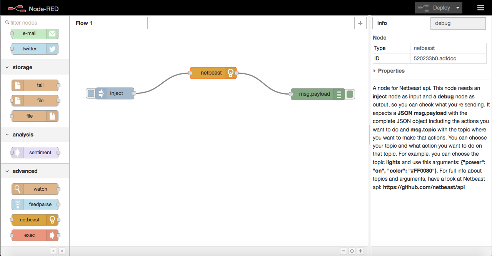
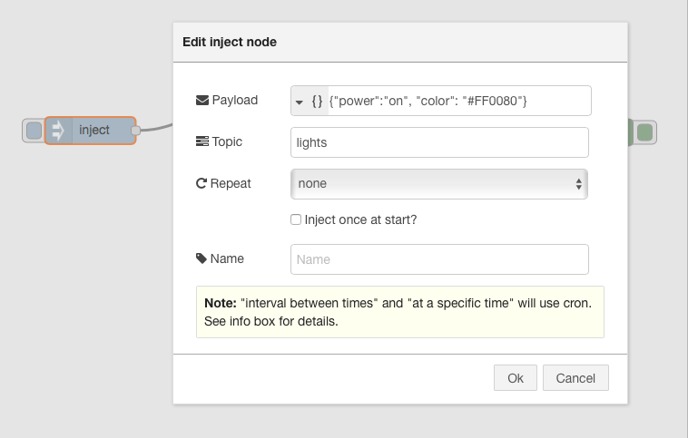

# Node-RED

http://nodered.org

Node-RED is a tool for wiring together hardware devices, APIs and online services in new and interesting ways.


Netbeast has included this tool as an application. So you can install that tool in the **Netbeast dashboard**. Also, you are able to install this tool in your device locally and create modules for it. 

If you want to know more about Node-red visit its [website](http://nodered.org) where you will find all the documentation available.

* [Install Locally](#Local)
* [Install on the Netbeast Dashboard](#Dashboard)

<a name="Local">
## Local Installation

The purpose of the local installation is allow developers to create modules which will be on the node-red app for the **Netbeast dashboard**

To install it locally, you just need to clone this repository
```
git clone https://github.com/netbeast/beast-red.git
```
Then go to the directory that has been created when cloning the repository
```
cd beast-red
```
Install all dependencies needed by using npm
```
npm install
```
Finally run node-red
```
node red.js --port 3000
```
Node red will start running on port 3000. If you want to select another port change the --port Number. And if you don't use the --port option, it will start running on port 1880.

<a name="Dashboard">
## Netbeast Dashboard

Netbeast has included the [node-red tool](http://nodered.org) as an application for its dashboard. So, if you want to get it, you only need to access to the **Install** section in the **Dashboard**.
Here you can install the application by two ways: exploring all available apps or downloading from git.
* **From explore**: look for the beast-red application and push the Install button. This will download the application in your dashboard.
* **From git**: paste this repo URL and it will start the download. 

After installing the app you will be able to run it from the **Apps** section in your dashboard.

If you want to know how to do this, go to this useful guide [netbeast docs](http://docs.netbeast.co/chapters/get_started/get_started_from_your_laptop.html)


## Netbeast API module
We have added a new module to integrate the Netbeast api. It has been developed by Netbeast Team.

Have a look at [Netbeast api](http://github.com/netbeast/api) for full information about available topics and arguments.

If you have followed this installation guide (locally or on dashboard) now you only have to start node-red and go to the browser if you installed it locally or run the beast-red app in the dashboard. If all went fine, you will have a new module called **"netbeast"** and you will be able to configure node-red to control your devices using Netbeast.

Here you have the nodes you need to include with the "netbeast" one so it can work propertly.



And here you can see an example of what you should write in the inject node.




##CONTACT

Netbeast: http://netbeast.co / staff@netbeast.co

##REFERENCES

- [Netbeast](http://netbeast.co)
- [Node-Red](http://nodered.org)
